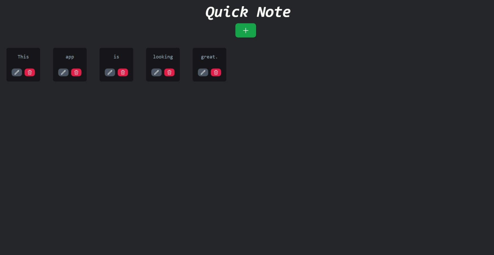

# Quick Note

## Description
Quick Note is a lightweight sticky note application that allows users to easily add, edit, and delete notes for quick reference.

## Screenshots

*Screenshot*

## How to Use
1. **Adding a Note:**
   - Click on the "+" button.
   - Enter the note content in the provided text area.
   - Click the "Save" button to save the note.

2. **Editing a Note:**
   - Click on the edit button of the note you want to edit.
   - Modify the content in the text area.
   - Click the "Save" button to update the note.

3. **Deleting a Note:**
   - Click on the delete button of the note you want to delete.

## Technologies Used
- Vite/React Js
- Tailwind CSS
- Supabase

## Contributors
- [K OM SENAPATI](https://github.com/kom-senapati)

Thanks for visiting!
